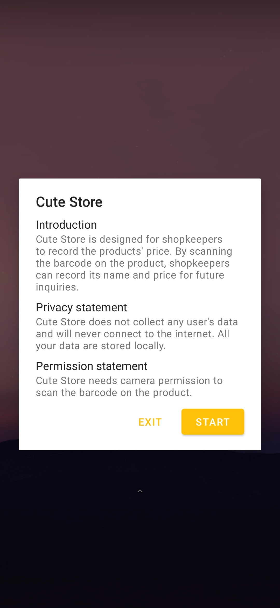
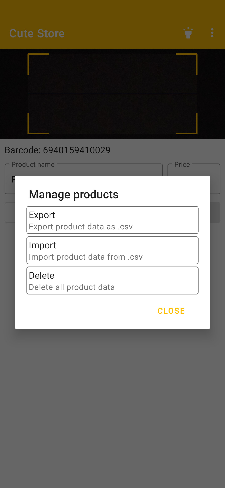
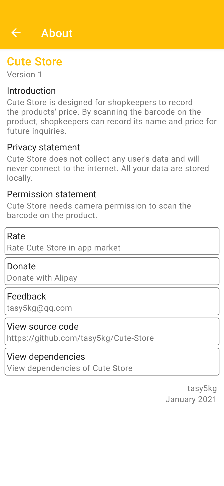

**English** | [简体中文](https://github.com/tasy5kg/Cute-Store/blob/main/README_zh-rCN.md)

# Cute Store

## Introduction

Cute Store is designed for shopkeepers to record the products' price. By scanning the barcode on the product, shopkeepers can record its name and price for future inquiries.

## Screenchot

    

## Download

[Github Releases](https://github.com/tasy5kg/Cute-Store/releases)

## Dependencies

```
androidx.appcompat:appcompat:1.2.0
me.dm7.barcodescanner:zbar:1.9.13
com.google.android.material:material:1.2.1
org.litepal.guolindev:core:3.2.2
```
