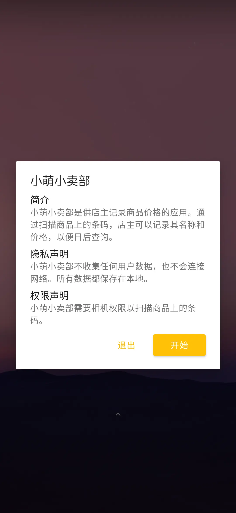
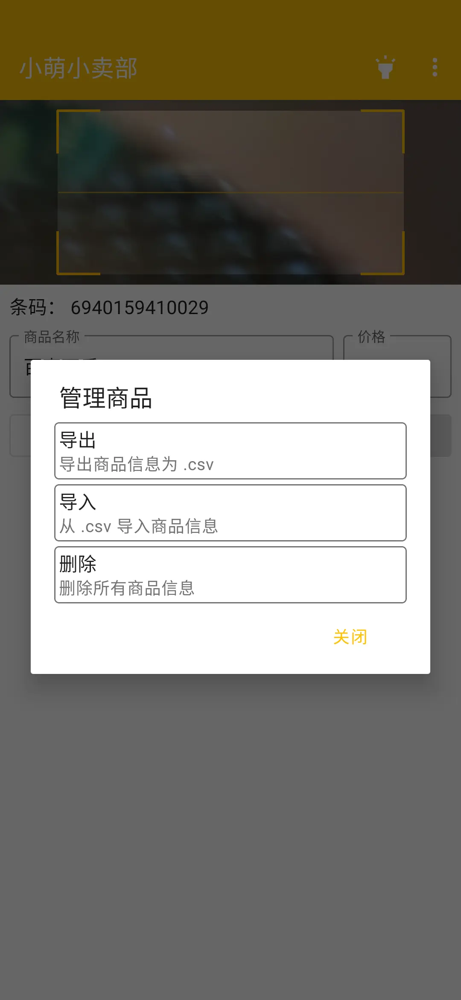

[English](https://github.com/tasy5kg/CuteStore/blob/main/README.md) | **简体中文**

# 小萌小卖部

## 简介

小萌小卖部是供店主记录商品价格的应用。通过扫描商品上的条码，店主可以记录其名称和价格，以便日后查询。

## 截图

    

## 下载

[Github Releases](https://github.com/tasy5kg/CuteStore/releases)

## 依赖项

```
androidx.appcompat:appcompat:1.2.0
me.dm7.barcodescanner:zbar:1.9.13
com.google.android.material:material:1.2.1
org.litepal.guolindev:core:3.2.2
```
